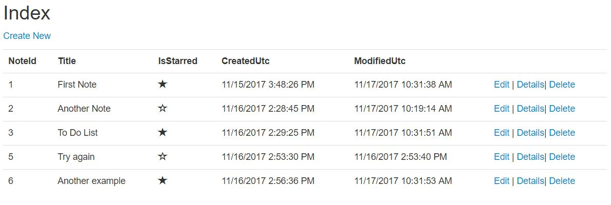

## Eleven Note

**Description:** The Eleven Note web application project was completed in class during the 301 portion of the course, which was led by Dave Fancher.  Users can create an account and then use the app to take notes. Since it is a CRUD app, the user can create, read, update, and delete their notes.  It also includes the option to star specific notes.

**Extension:** The NoteID field should be hidden on the Note List View.  The titles of certain fields should also be renamed.  For example, "IsStarred" should be changed to "Star" or "Important."

**Screenshot of List of Notes:** 

**Credit to Guest Instructor:** Dave Fancher | https://github.com/davefancher

**Contact Information:** Monica Marek | monicamarek24@gmail.com
